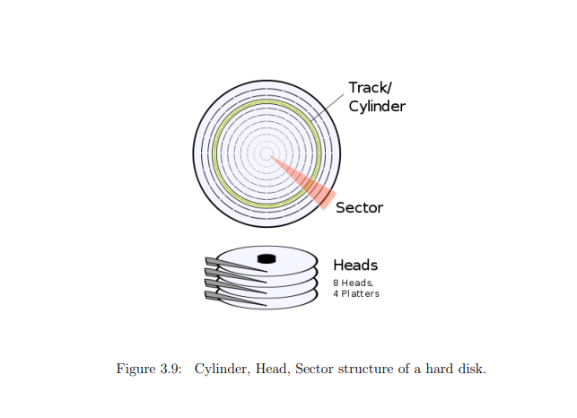

# Introduction

This document explains all the code in the file `src/boot_sector/disk.asm`.
This file manage all the hard disk related stuff.

## Table of content

- [Introduction](#introduction)
  - [Table of content](#table-of-content)
  - [Disk structure ](#disk-structure-)
      - [Head](#head)
      - [Cylinder](#cylinder)
      - [Sector](#sector)
  - [Disk routines ](#disk-routines-)
  - [Code explaination ](#code-explaination-)

## Disk structure <a name="disk-structure"></a>

The structure of a hard disk is quite simple, it inherits the real structure of hard disks of that time.
Here is a simple schema of the structure of a hard disk:

You can see that the hard disk is divided in 4 parts, the biggest part is the head, an head contains many cylinders and a cylinder contains many sectors.
Here is a description of what is a head, a cylinder and a sector:

#### Head

The head is the needle that is used to read and write on a disk, so a head represents on which disk you want to write. In asm, the head is represented by the `DH` register.

#### Cylinder

The cylinder is a division of the disk in a vertical way. It's used to represent the position of the head on the disk. In asm, the cylinder is represented by the `CH` register.

#### Sector

The sector is a division of the disk in a horizontal way. It's used to represent the position of the head on the disk. In asm, the sector is represented by the `CL` register.

## Disk routines <a name="disk-routines"></a>

To access the hard disk, we need to use some routines, but first we need to know on which mode we want to access the hard disk. It's important because the hard disk can only be directly accessed by the CPU in RM and not in PM or above. In the file [boot_sector/disk.asm](../../../src/boot_sector/disk.asm) there is only the routine for RM, but if you want to access the hard disk in PM or above you will need to use the BIOS to communicate with the hard disk.

To read the disk we need to call the interrupts 0x13 `ah` set to 0x02. All thoses register needs to be set before calling the interrupt:
- `al`: number of sectors to read
- `ch`: cylinder
- `cl`: sector
- `dh`: head
- `dl`: drive

Once all of this is done, the interrupts will read the sectors and put them in the memory at the address `es:bx`.

## Code explaination <a name="code-explaination"></a>

So, if you read all the previous part, you should know how to read the hard disk. In this file, we created a function named `disk_load` that will load the sectors from the hard disk to the memory. This function takes only two parameters:
- `bx` for the address in memory where the sectors will be loaded
- `dl` for the drive number
- `dh` for the number of sectors to read (yes if you already read [Disk routines](#disk-routines) you must know that it's the `al` register but if we are using `dh` instead of `al` it's because we are using only one register (`dx`) so it's cleaner)

Once all of this is set we can call this function:
```nasm
disk_load:
    push dx
    mov ah, 0x02
    mov al, dh
    mov ch, 0x00
    mov dh, 0x00
    mov cl, 0x02
    int 0x13
    jc disk_error
    pop dx
    cmp dh, al
    jne disk_error
    ret
```

It's not a pretty hard function, it's just a wrapper around the interrupt 0x13. The only thing that is a bit tricky is the `jc disk_error`.
The first line is `push dx`, it's storing the register dx to the stack so we can use it later. The register dx is containing both of the register dh and dl. dl is the low bytes of dx (the first byte) and dh is the high bytes of dx (the second byte). So we are storing the register dx to the stack so we can use it later.
After we have a couple of line:
```nasm
mov ah, 0x02
mov al, dh
mov ch, 0x00
mov dh, 0x00
mov cl, 0x02
```
Those line is just setting all the register needed to call the interrupts 0x13 and read the sectors. Remember that we have `dh` for the number of sectors to read and `dl` for the drive number (dl is already set).
After that we just need to call the interrupt 0x13 with the command `int 0x13`. A particularity of the interrupts is that if it fails it will set the carry flag (CF) to 1. So we need to check if the carry flag is set to 1, to do this the keyword `jc` is used. If the carry flag is set to 1, it will jump to the label `disk_error` and if it's not set to 1 it will continue the execution of the function.
Finally, we need to check if the number of sectors read is the same as the number of sectors we wanted to read. If it's not the same, it means that there was an error and we need to jump to the label `disk_error`. If it's the same, we just need to return from the function.
```nasm
    pop dx                  ; Restore DX from the stack
    cmp dh, al              ; if AL ( sectors read ) != DH ( sectors expected )
    jne disk_error          ; display error message
    ret

disk_error:
    jmp $
```
Theses lines are just restoring the register `dx` from the stack (previously pushed) and checking if the number of sectors read is the same as the number of sectors we wanted to read. If it's not the same, it means that there was an error and we need to jump to the label `disk_error`. If it's the same, we just need to return from the function.